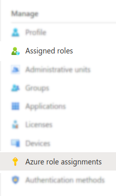
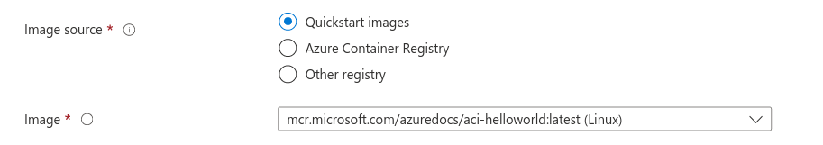

# Sysdig Secure for Cloud in Azure

Terraform module that deploys the [**Sysdig Secure for Cloud** stack in **Azure**](https://docs.sysdig.com/en/docs/installation/sysdig-secure-for-cloud/deploy-sysdig-secure-for-cloud-on-azure).
<br/>

Provides unified threat-detection, compliance, forensics and analysis through these major components:

* **[Threat Detection](https://docs.sysdig.com/en/docs/sysdig-secure/insights/)**: Tracks abnormal and suspicious
  activities in your cloud environment based on Falco language. Managed through `cloud-connector` module. <br/>

* **[Compliance](https://docs.sysdig.com/en/docs/sysdig-secure/posture/compliance/compliance-unified-/)**: Enables the
  evaluation of standard compliance frameworks. Requires both modules  `cloud-connector` and `cloud-bench`. <br/>

* **[Image Scanning](https://docs.sysdig.com/en/docs/sysdig-secure/scanning/)**:
  Automatically scans images that run on the Azure workload (currently AzureContainerInstances).<br/>
  Define an AzureRegistry (ACR) through `registry_name` and also scan all the repository images pushed to the
  registry.<br/>
  Managed through `cloud-connector`. <br/>Scanning is disabled by default, can be enabled through `deploy_scanning`
  input variable parameters.<br/>

For other Cloud providers check: [AWS](https://github.com/sysdiglabs/terraform-aws-secure-for-cloud)
, [GCP](https://github.com/sysdiglabs/terraform-google-secure-for-cloud)

<br/>

## Usage

There are several ways to deploy Secure for Cloud in you AWS infrastructure, 
- **[`/examples`](https://github.com/sysdiglabs/terraform-azurerm-secure-for-cloud/tree/master/examples)** for the most common scenarios
  - [Single Subscription](https://github.com/sysdiglabs/terraform-azurerm-secure-for-cloud/tree/master/examples/single-subscription/README.md)
  - [Single Subscription with a pre-existing Kubernetes Cluster](https://github.com/sysdiglabs/terraform-azurerm-secure-for-cloud/tree/master/examples/single-subscription-k8s/README.md)
  - [Tenant Subscriptions](https://github.com/sysdiglabs/terraform-azurerm-secure-for-cloud/tree/master/examples/tenant-subscriptions/README.md)
  - Many module,examples and use-cases, we provide ways to **re-use existing resources (as optionals)** in your
    infrastructure. Check input summary on each example/module.

Find specific overall service arquitecture diagrams attached to each example/use-case.

<!--
In the long-term our purpose is to evaluate those use-cases and if they're common enough, convert them into examples to make their usage easier.
--> 

If you're unsure about what/how to use this module, please fill the [questionnaire](https://github.com/sysdiglabs/terraform-aws-secure-for-cloud/blob/master/use-cases/_questionnaire.md) report as an issue and let us know your context, we will be happy to help.


### Notice
* **Resource creation inventory** Find all the resources created by Sysdig examples in the resource-group `sysdig-secure-for-cloud`<br/>
* All Sysdig Secure for Cloud features but [Image Scanning](https://docs.sysdig.com/en/docs/sysdig-secure/scanning/) are enabled by default. You can enable it through `deploy_scanning` input variable parameters.<br/>
* **Deployment cost** This example will create resources that cost money. Run `terraform destroy` when you don't need them anymore
* For **free subscription** users, beware that organizational examples may not deploy properly due to the [1 cloud-account limitation](https://docs.sysdig.com/en/docs/administration/administration-settings/subscription/#cloud-billing-free-tier). Open an Issue so we can help you here!


<br/>

## Permissions

- Threat Detection feature requires `Contributor` subscritpion-level role user assignment
    - For AD diagnostic `Security Administrator` role must be granted to at Organizational level.

      Otherwise, it can be disabled setting `deploy_active_directory=false` on all examples
- For scanning, an App (with its Service Principal) is required to be created in the ActiveDirectory, to enable
  ContainerRegistry Task to run the image scanning This requires subscription-level `Security Administrator` role.

Note: Beware that pervious roles in AD are found in two different levels; Organizational level (user AD **Assigned
Roles**), and Subscription level (user AD **Azure role assignments**). This role assignments take some time to
consolidate.



<br/>


## Confirm the Services are Working

Check official documentation on [Secure for cloud - AWS, Confirm the Services are working](https://docs.sysdig.com/en/docs/installation/sysdig-secure-for-cloud/deploy-sysdig-secure-for-cloud-on-azure/#confirm-the-services-are-working)

### Forcing Events - Threat Detection

Choose one of the rules contained in an activated Runtime Policies for Azure, and execute it in your Azure account.

Alternativelly, use Terraform example module to trigger _Azure Access Level creation attempt for Blob Container Set to Public_ event can be
found on [examples/trigger-events](https://github.com/sysdiglabs/terraform-azurerm-secure-for-cloud/blob/master/examples/trigger-events).

### Forcing Events - Image Scanning

- For registry image scanning (ACR), upload any image to a registry repository.
  ```shell
  $ docker login -u xxx -p  xxx your-registry.azurecr.io  # acr access-key user and password
  $ docker tag your-registry.azurecr.io/artifact:tag
  $ docker push your-registry.azurecr.io/artifact:tag
  ```
- For workload image scanning in AzureContainerInstances (ACI), deploy any workload to an instance. Azure gives you the option for a quickstart
  

<br/><br/>

## Troubleshooting

### Q-Scanning: I see no image result on Secure

A: 1. Check that the repository where you're uploading images to, is from a registry that has been configured on the
deployment, otherwise configure it through `registry_name` input variable <br/>

2. Check that in this registry 'Tasks > Runs' a new image scanning deployment has been spawned<br/>
3. Check if in the CloudConnector ContainerInstance any log shows that a new image has been detected<br/>

### Q-Azure: Getting Error 403 on Monitor AAD Diagnostic Setting

```shell
│ Error: checking for presence of existing Monitor AAD Diagnostic Setting: (Name "iru-aad-diagnostic-setting"):
aad.DiagnosticSettingsClient#Get: Failure responding to request: StatusCode=403
-- Original Error: autorest/azure: Service returned an error.
Status=403 Code="AuthorizationFailed" Message="The client 'iru@***.onmicrosoft.com' with object id '***' does not have authorization to perform action
'microsoft.aadiam/diagnosticSettings/read' over scope '/providers/microsoft.aadiam/diagnosticSettings/iru-aad-diagnostic-setting' or the scope is invalid.
If access was recently granted, please refresh your credentials."
```

A: Deployment user has not enough permissions to enable AD diagnostic settings for threat-detection.<br/>
S:  Check [Permissions](#permissions) section

### Q-Azure: Getting Error 404 could not configure MSI Authorizer: NewMsiConfig: could not validate MSI endpoint

```shell
╷
│ Error: could not configure MSI Authorizer: NewMsiConfig: could not validate MSI endpoint: received HTTP status 404
│
│   with provider["registry.terraform.io/hashicorp/azuread"],
│   on main.tf line 1, in provider "azuread":
│    1: provider "azuread" {
```

A: This may happen if you're using Azure console shell to deploy terraform. MSI (managed service identity has connection
limitations)<br/>
S: Unset `MSI_ENDPOINT` environment variable [[1](https://github.com/hashicorp/terraform-provider-azuread/issues/633)].
We will upgrade provider soon to avoid this.

<br/><br/>

## Upgrading

- Uninstall previous deployment resources before upgrading
  ```
  $ terraform destroy
  ```

- Upgrade the full terraform example with
  ```
  $ terraform init -upgrade
  $ terraform plan
  $ terraform apply
  ```

- If required, you can upgrade cloud-connector component by restarting the task (stop task). Because it's not pinned to an specific version, it will download the latest one.

<br/>

## Authors

Module is maintained and supported by [Sysdig](https://sysdig.com).

## License

Apache 2 Licensed. See LICENSE for full details.
